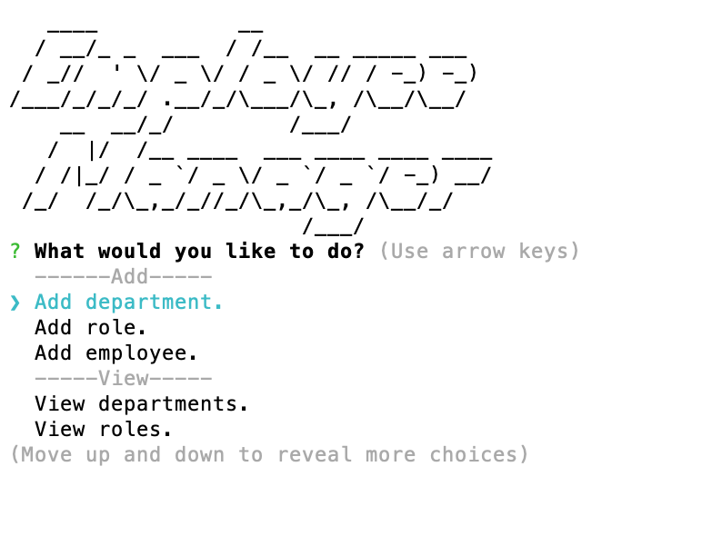

# Employee Manager
A CMS for viewing and updating employee information.

## Table of Contents
1. [ Description ](#desc)
2. [ Visuals ](#visuals)
3. [ Deployed Webpage ](#deployed)
4. [ Support ](#support)
5. [ Authors and Acknowledgement ](#acknowledge)
6. [ Next Steps ](#next)
7. [ License ](#license)

## 1. Description
A command line interface that lets you create, read, update, and delete employee records.

### Note:
The `go back` functionality sadly is not currently working.

### Summary of functionality
- The user can add/update and delete employees, employees roles and departments.
- The user can view the budget of a particular department.
- The user can add managers/roles/departments for a selected employee on the fly by selecting other.
- Employee records are saved in a database.

## 2. Visuals
Screenshot of the CLI:

## 3. Install
Simply download the file, maneuver to the folder in your directory and run `npm i`.

## 4. Support
Should you find an issue with this webpage, please create a [new issue](https://github.com/Tasha876/Employee-Manager/issues/new/choose) on my GitHub repository.

## 5. Authors and Acknowledgement
The code in this project was created by Natasha Fray. The idea is from the instructors at the [U of T Coding Bootcamp](https://bootcamp.learn.utoronto.ca/)

## 6. Next Steps
This is a very simple employee manager and could benefit from the following updates
- Added functionality to the 'go back' selections.
- The ability to *stop* recursively adding managers.
- Improved UI.
- Improved logs so that the user is more more sure of what it is they are updating.

## 7. License
This project is covered by the [MIT](license) license.

